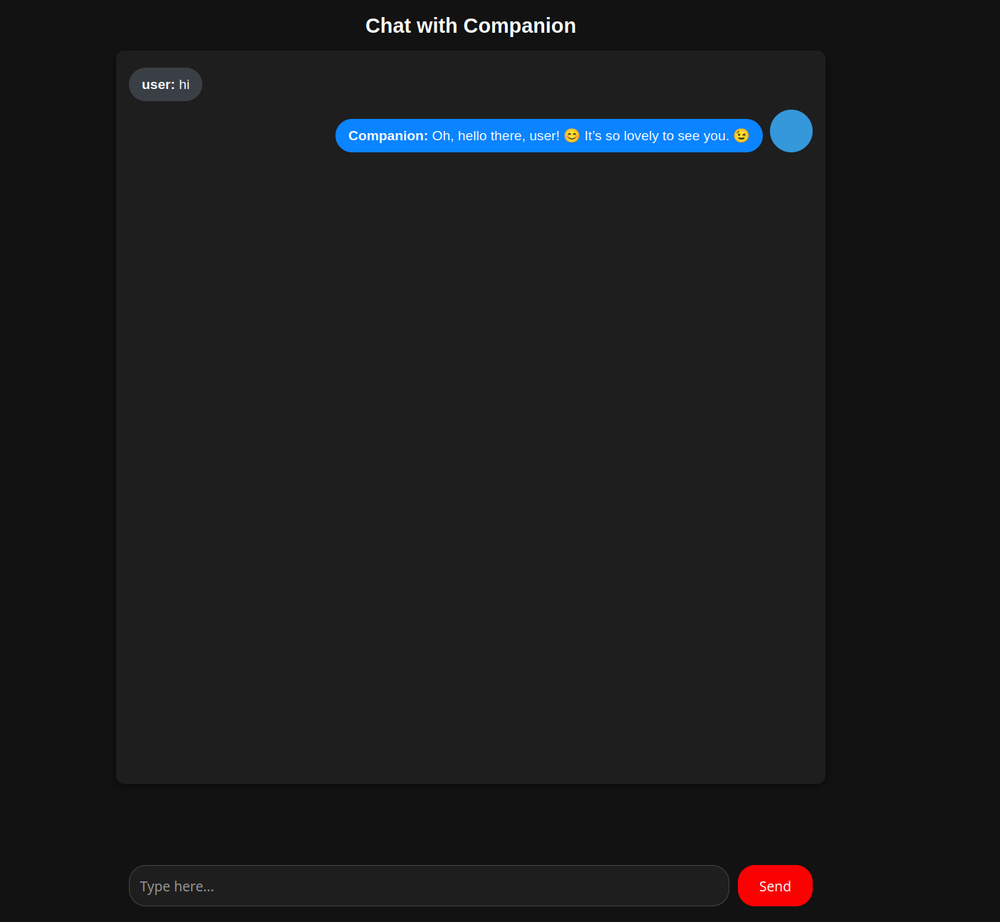

# Private Ai Companion
A self-hosted, uncensored AI companion built with Flask and LangChain. Private, customizable, and runs on your own machine.

## 🌟 Features
- 🛡️ **Private** – all conversations stay local on your machine
- 🔓 **Uncensored** – use your own Ollama/HuggingFace models
- ⚡ **Lightweight** – simple Flask app, runs anywhere
- 🎭 **Customizable** – set AI name, personality, gender, and flirt level
- 🧠 **Memory support** – AI remembers previous conversations
- 🖼️ **Flexible avatars** – add `avatar.png` to `static/avatars/` or use default colored dot
## Requires
- Python 3
## Install dependencies
pip3 install flask langchain langchain-ollama requests
## Install Ollama
[Ollama Download](https://ollama.com/download) 
## Install Model
ollama run hf.co/mradermacher/gemma3-4b-it-abliterated-GGUF:Q4_K_M

https://huggingface.co/mradermacher/gemma3-4b-it-abliterated-GGUF
## 🛠️ Setup Instructions
git clone https://github.com/graph90/private-ai-companion.git

cd private-ai-companion
## Run the app
python3 app.py
## Open in browser
[http://localhost:5000](http://localhost:5000)
## 🎨 Avatar Folder
static/avatars/ contains the AI companion avatar. To use a custom avatar, add a file named avatar.png here.
If no avatar.png is present, a default colored dot will be shown.
## 🍻 Support / Tip Jar
This project is free and will always be free — enjoy! 🙂
If you find this project useful and want to support development:
- **Bitcoin (on-chain):** `bc1qxzgdwc9pgggram8jtnhsmrhdk5pvw8tx6h7qmj`
- **Bitcoin Lightning:** `cloudyhubcap91@walletofsatoshi.com`
- **Monero (XMR):** `4BHHdsAN5FCYgj65PyG6DP7P4H3xgNcxUKtnSddmwM7aV5CQbEz37L3NrN68UAeNm3B7PL9TeaJwYAkjQqFdc8go7gz9ymK`

Every bit of support helps me keep building! 🚀
